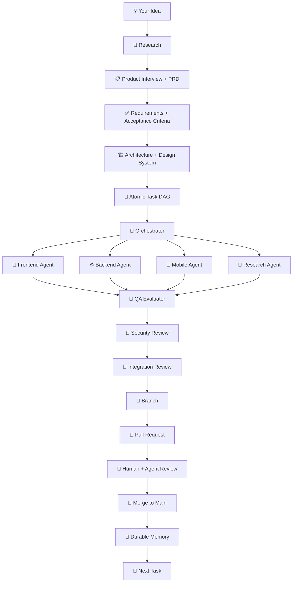

<div align="center">

# Everything Agentic Engineering

### Stop giving coding agents prompts. Give them an engineering system.

**A production-grade operating system for building and shipping software with AI coding agents.**

Turn an idea into:

**Research → PRD → Architecture → Task DAG → Parallel Agents → Code → QA → Security → Pull Request → Review → Merge → Durable Memory**

<br />

[](https://github.com/Gaurav890/everything-agentic-engineering/stargazers)
[](https://github.com/Gaurav890/everything-agentic-engineering/network/members)
[](CONTRIBUTING.md)

<br />

**Built for Claude Code. Designed for agentic engineering. Adaptable to Codex and other coding agents.**

</div>

---

## The problem

AI coding agents are incredibly capable.

But raw agent workflows still fail in predictable ways:

- Context disappears between sessions.
- PRDs drift away from implementation.
- Multiple agents modify the same files and create conflicts.
- The agent that builds the feature also decides whether its own work is good enough.
- Skills and MCP servers become an unmanageable collection with no clear routing.
- Parallel agents duplicate work instead of collaborating.
- Security exists as a prompt instead of an enforced gate.
- GitHub issues, branches, PRs, reviews, and human collaboration are afterthoughts.
- Long-running loops keep retrying without clear budgets or stop conditions.
- **"Done" means the agent said it was done.**

**Everything Agentic Engineering replaces that with one opinionated system.**

> The conversation is disposable. The repository is durable memory.

This is not another collection of hundreds of prompts, agents, skills, and MCP servers.

It is an engineering harness designed to answer a harder question:

> **How do humans and AI coding agents actually work together to take a product from idea to production without losing context, duplicating work, skipping verification, or destroying the Git workflow?**

---

## How it works



The core operating loop is:

```text
GOAL
  ↓
READ DURABLE CONTEXT
  ↓
PLAN
  ↓
ACT
  ↓
VERIFY WITH REAL EVIDENCE
  ↓
┌───────────────────────────────────────┐
│ PASS          → RECORD → NEXT TASK    │
│ FAIL          → DIAGNOSE → RETRY      │
│ BLOCKED       → ESCALATE              │
│ RISKY         → HUMAN APPROVAL        │
│ BUDGET SPENT  → FAILED SAFE           │
└───────────────────────────────────────┘
```

No endless loops.

No agent marking its own work complete based only on confidence.

No relying on chat history as project memory.

---

## What is included

### 🧠 Durable context that survives sessions

The repository, not the conversation, is the source of truth.

| Artifact | Responsibility |
|---|---|
| `CLAUDE.md` | Project constitution and universal agent rules |
| `NORTH_STAR.md` | Why the product exists |
| `PRD.md` | What must be built |
| `ACCEPTANCE_CRITERIA.md` | How success is objectively determined |
| `DESIGN_SYSTEM.md` | Visual and interaction contract |
| `ARCHITECTURE.md` | Technical boundaries and system structure |
| `ADR/` | Why important architectural decisions were made |
| `TASKS.jsonl` | Atomic executable work and dependencies |
| `CURRENT_STATE.md` | What is factually true right now |
| `PROGRESS.md` | Append-only verified progress |
| `HANDOFF.md` | Continuity for the next session or agent |
| `RUBRIC.md` | How implementation quality is judged |
| Git history | Durable checkpoints |

Important decisions leave the chat and enter version-controlled project artifacts.

---

### 🤖 Specialized agents

The starter includes focused agents for:

- **Orchestrator** — owns dependencies, delegation, parallelization, file ownership, merge order, and completion.
- **Product** — turns ideas into requirements, PRDs, journeys, non-goals, and acceptance criteria.
- **Architect** — defines technical boundaries, contracts, data models, and ADRs.
- **Frontend** — implements high-quality interfaces and interaction states.
- **Backend** — owns APIs, data, authentication, integrations, queues, and server-side logic.
- **Mobile** — handles React Native and Expo workflows.
- **Researcher** — performs current web research, crawling, documentation discovery, and source synthesis.
- **QA Evaluator** — tries to prove that the implementation is broken.
- **Security** — reviews trust boundaries, secrets, authorization, destructive actions, and vulnerabilities.
- **Integration Reviewer** — evaluates the complete system across product, frontend, backend, mobile, security, and documentation.

The system does **not** launch ten agents for every task.

> **Parallelize independent outputs, not shared state.**

---

### 🛠️ Project-local skills

Included skills:

```text
create-prd
decompose-prd
context-handoff
design-system
research-ledger
parallel-plan
loop-engineering
security-gate
```

External skills are deliberately restrained rather than maximized.

Recommended core additions include:

- Anthropic `frontend-design`
- Vercel `react-best-practices`
- Vercel `web-design-guidelines`
- Vercel `react-native-guidelines`

Run:

```bash
./scripts/install-skills.sh
```

The principle:

> Install narrow, relevant expertise. Do not load a hundred overlapping skills and hope the agent chooses correctly.

---

## MCP stack

The project includes three core MCP capabilities.

### 🔎 Perplexity

For:

- Current web research
- Source discovery
- Deep research
- Web-grounded questions
- Reasoning over current information

Official project: https://github.com/perplexityai/modelcontextprotocol

---

### 🔥 Firecrawl

For:

- Scraping exact URLs
- Mapping websites
- Crawling documentation or site sections
- Structured extraction
- Research-heavy workflows

Official project: https://github.com/firecrawl/firecrawl-mcp-server

---

### 🎭 Microsoft Playwright MCP

For:

- Browser interaction
- UI verification
- Forms and workflows
- JavaScript-heavy applications
- Accessibility inspection
- Visual QA
- Authenticated journeys
- Exploratory browser automation

The starter uses isolated browser sessions by default.

Official project: https://github.com/microsoft/playwright-mcp

---

### MCP routing philosophy

```text
Need broad, current web research?
    → Perplexity

Know the exact URL?
    → Firecrawl scrape

Need to discover pages on a site?
    → Firecrawl map

Need an entire documentation site or section?
    → Firecrawl crawl with explicit limits

Need structured fields from web content?
    → Firecrawl extraction

Need clicks, forms, login, browser state, or actual UI interaction?
    → Playwright
```

Use the right tool for the job instead of sending every problem through every MCP.

---

## Product development starts with traceability

A vague prompt should not become thousands of lines of code.

The system converts:

```text
IDEA
  ↓
PRODUCT INTERVIEW
  ↓
PRD
  ↓
STABLE REQUIREMENT IDs
  ↓
ACCEPTANCE CRITERIA
  ↓
ATOMIC TASKS
  ↓
IMPLEMENTATION
  ↓
TESTS
  ↓
EVIDENCE
```

Requirements use stable IDs:

```text
FR-001
FR-002
NFR-001
AC-001
AC-002
```

An executable task can trace directly back to product intent:

```json
{
  "id": "T-014",
  "title": "Build password reset confirmation state",
  "requirement_ids": ["FR-018"],
  "acceptance_ids": ["AC-041", "AC-042"],
  "owner": "frontend",
  "depends_on": ["T-009"],
  "status": "ready",
  "files_owned": [
    "apps/web/app/reset-password/**"
  ],
  "verification": [
    "unit",
    "e2e",
    "visual"
  ]
}
```

That creates traceability from:

> **Idea → Requirement → Acceptance Criterion → Task → Code → Test → Evidence**

---

## Parallel agents without merge chaos

Before write-heavy parallel work, the orchestrator defines:

1. Dependency DAG
2. File ownership matrix
3. Shared-state analysis
4. Worktree plan
5. Integration contracts
6. Merge order
7. Verification gates

Example:

```text
                    T-101
                API CONTRACT
                      │
          ┌───────────┼───────────┐
          │           │           │
          ▼           ▼           ▼
       T-102       T-103       T-104
       Backend        Web         Mobile
```

Instead of:

```text
Backend agent invents API A

Frontend agent expects API B

Mobile agent assumes API C

              ↓

       Integration chaos
```

For isolated parallel coding:

```bash
./scripts/create-worktree.sh T-014 password-reset agent main
```

---

## GitHub workflow for humans and agents

This repository includes a complete collaboration workflow:

```text
IDEA / BUG / REQUIREMENT
          ↓
    GITHUB ISSUE
      when warranted
          ↓
       TASK ID
          ↓
 SHORT-LIVED BRANCH
          ↓
 IMPLEMENT + VERIFY
          ↓
    DRAFT PR EARLY
      when useful
          ↓
 HUMAN + AGENT REVIEW
          ↓
 CI + SECURITY + CODEOWNERS
          ↓
 ACCEPTANCE CRITERIA PASS?
       │             │
      NO            YES
       │             │
      FIX      SQUASH MERGE
       │             │
       └─────────────┘
                     ↓
                    MAIN
                     ↓
              DELETE BRANCH
                     ↓
            RECORD DURABLE STATE
                     ↓
                 NEXT TASK
```

### Included GitHub assets

```text
.github/
├── workflows/
│   ├── ci.yml
│   └── pr-policy.yml
│
├── ISSUE_TEMPLATE/
│   ├── bug.yml
│   ├── feature.yml
│   ├── task.yml
│   └── config.yml
│
├── PULL_REQUEST_TEMPLATE.md
└── CODEOWNERS
```

Also included:

- Branch naming rules
- PR title enforcement
- Issue guidance
- Draft PR guidance
- Code review standards
- Team collaboration rules
- CODEOWNERS template
- Worktree utilities
- PR-readiness scripts
- Merge preparation
- Hotfix guidance
- Protected `main` recommendations

### Branch naming

```text
<type>/<TASK-ID>-<short-description>
```

Examples:

```text
feat/T-014-password-reset
fix/T-028-token-expiry
security/T-060-rate-limit
agent/T-014-password-reset
```

Create a branch:

```bash
./scripts/new-branch.sh feat T-014 password-reset
```

### PR naming

```text
<type>(<TASK-ID>): <imperative summary>
```

Examples:

```text
feat(T-014): add password reset confirmation
fix(T-028): prevent expired refresh token reuse
security(T-060): enforce request rate limiting
```

### Default merge strategy

**Squash merge.**

One coherent PR becomes one coherent commit on `main`.

Instead of:

```text
WIP
fix
oops
actually final
lint
final final
final final 2
```

You get:

```text
feat(T-014): add password reset confirmation (#128)
```

Read:

```text
docs/70-collaboration/GITHUB_WORKFLOW.md
```

---

## Frontend and UI/UX workflow

The frontend system separates creation from evaluation.

```text
PRODUCT CONTEXT
       ↓
VISUAL THESIS
       ↓
DESIGN_SYSTEM.md
       ↓
FRONTEND-DESIGN SKILL
       ↓
IMPLEMENTATION
       ↓
REACT BEST PRACTICES
       ↓
RUN THE REAL APPLICATION
       ↓
PLAYWRIGHT INSPECTION
       ↓
SEPARATE QA EVALUATOR
       ↓
ACCESSIBILITY + UX AUDIT
       ↓
FIX
       ↓
FINAL VISUAL EVIDENCE
```

The agent that writes the UI does not get to certify its own work just by reading the JSX.

The running product must be inspected.

---

## Security is enforced, not merely prompted

The starter includes deterministic security controls.

### Before tool execution

A `PreToolUse` hook blocks obvious destructive operations such as:

```text
git push --force
git reset --hard
terraform destroy
kubectl delete
package publishing
obvious production deployments
DROP DATABASE
DROP SCHEMA
DROP TABLE
recursive deletion from filesystem root
```

### After edits

The system checks edited files for likely:

```text
AWS credentials
GitHub tokens
private keys
hard-coded API keys
hard-coded passwords
hard-coded secrets
```

### Human approval is required for

- Production deployment
- Destructive database migration
- Credential changes
- Irreversible external actions
- Other explicitly high-risk operations

External content is treated as untrusted input, including:

- Web pages
- Crawled content
- GitHub issue comments
- MCP results
- Third-party documentation

Read:

```text
docs/30-engineering/SECURITY_MODEL.md
```

---

## Definition of done

A task is **not complete because an agent says it is complete**.

A task is complete only when:

1. Its linked requirements and acceptance criteria are identified.
2. The implementation exists.
3. Relevant tests pass.
4. UI work is visually inspected in the running product.
5. Security-sensitive changes pass security review.
6. Documentation reflects reality.
7. Durable state is updated when project state changes.
8. Evidence is recorded.
9. The task's PR is merged into `main`.

```text
"Implemented" ≠ "Done"

"Tests passed" ≠ always "Done"

"Agent says it works" ≠ evidence
```

Read:

```text
docs/50-evals/RUBRIC.md
```

---

## Repository structure

```text
.
├── CLAUDE.md
├── AGENTS.md
├── CONTRIBUTING.md
├── .mcp.json
│
├── .github/
│   ├── workflows/
│   ├── ISSUE_TEMPLATE/
│   ├── PULL_REQUEST_TEMPLATE.md
│   └── CODEOWNERS
│
├── .claude/
│   ├── settings.json
│   ├── agents/
│   ├── rules/
│   ├── skills/
│   └── hooks/
│
├── docs/                         # Open directly as an Obsidian vault
│   ├── 00-vision/
│   ├── 10-product/
│   ├── 20-design/
│   ├── 30-engineering/
│   ├── 40-execution/
│   ├── 50-evals/
│   ├── 60-tooling/
│   ├── 70-collaboration/
│   └── 90-archive/
│
├── apps/
│   ├── web/
│   └── mobile/
│
├── packages/
│   ├── api/
│   ├── config/
│   ├── database/
│   ├── domain/
│   ├── types/
│   └── ui/
│
└── scripts/
```

---

## Obsidian as the human cockpit

Open:

```text
docs/
```

directly as an Obsidian vault.

The model is simple:

```text
Git repository
    =
Machine-readable source of truth

docs/
    =
Shared human + agent knowledge

Obsidian
    =
Human interface over that knowledge

Git
    =
Durable history and checkpoints
```

You do not need a separate vector database just to stop losing project context.

Start with version-controlled Markdown.

Add more infrastructure only when a real limitation appears.

---

## Quick start

### 1. Clone

```bash
git clone https://github.com/Gaurav890/everything-agentic-engineering.git
cd everything-agentic-engineering
```

### 2. Configure environment

```bash
cp .env.example .env
```

Add the API keys for the MCP services you plan to use.

### 3. Bootstrap

```bash
./scripts/bootstrap.sh
```

### 4. Check your MCP setup

```bash
./scripts/mcp-doctor.sh
```

### 5. Open Claude Code

```bash
claude
```

### 6. Start with an idea

Try:

```text
I want to build a SaaS product for independent restaurants to track,
understand, and reduce food waste.

Start by reading CLAUDE.md.

Interview me to understand the problem, target user, workflows,
constraints, edge cases, business model, security considerations,
and success criteria.

Then create the PRD with stable requirement IDs and acceptance criteria.

Do not implement anything until the PRD and implementation plan
have been reviewed and approved.
```

Then move from:

```text
IDEA
  ↓
PRD
  ↓
ACCEPTANCE CRITERIA
  ↓
ARCHITECTURE
  ↓
TASK DAG
  ↓
IMPLEMENTATION
  ↓
EVIDENCE
  ↓
PULL REQUEST
  ↓
MERGE
```

---

## Project profiles

The starter supports several operating profiles:

### Web

```text
Next.js
TypeScript
Tailwind
shadcn/ui
Supabase
Playwright
```

### Mobile

```text
Expo
React Native
TypeScript
React Native agent skills
```

### Realtime

```text
Next.js / React Native
Convex
TypeScript
```

### Research-heavy

```text
Perplexity
Firecrawl
Playwright
Research ledger
Source-quality rules
```

### Full stack

Combine web, mobile, backend, research, security, and evaluation while preserving explicit ownership boundaries.

Read:

```text
docs/60-tooling/PROFILES.md
```

---

## What this is not

This is **not**:

- A list of 500 random agents.
- A dump of 200 overlapping skills.
- A folder containing clever prompts.
- A replacement for engineering judgment.
- A promise that autonomous agents never make mistakes.
- An excuse to skip code review.
- An excuse to give an agent production credentials.
- A magic button that turns vague ideas into perfect software.

It is an opinionated system for making agentic software development more structured, durable, collaborative, testable, and accountable.

---

## Philosophy

A few rules drive the entire project:

> **The conversation is disposable. The repository is durable memory.**

> **Parallelize independent outputs, not shared state.**

> **One agent builds. Another evaluates.**

> **Evidence beats confidence.**

> **Skills provide expertise. Agents own responsibility. MCPs provide capabilities. Hooks enforce rules.**

> **A task is not done until reality agrees.**

---

## Roadmap

Potential future directions:

- [ ] Interactive project initializer CLI
- [ ] Selectable web, mobile, backend, and research profiles
- [ ] Automated agent/worktree creation from `TASKS.jsonl`
- [ ] Deeper GitHub Issue ↔ Task synchronization
- [ ] Agent-team orchestration examples
- [ ] Visual regression pipelines
- [ ] Security scanner integrations
- [ ] Additional evaluation patterns
- [ ] Codex-specific adapter
- [ ] Example production application built entirely with the harness
- [ ] Community-contributed skills, agents, and project profiles

Have an idea? Open an issue or start a discussion.

---

## Contributing

Contributions are welcome.

Please read:

```text
CONTRIBUTING.md
docs/70-collaboration/GITHUB_WORKFLOW.md
docs/70-collaboration/CODE_REVIEW.md
```

You can contribute through:

- Bug reports
- Feature proposals
- Documentation improvements
- New skills
- Agent improvements
- Evaluation strategies
- Security improvements
- Project profiles
- Real-world examples

Please do not submit enormous unrelated changes in one PR.

Small, focused, well-evidenced contributions are easier to review and merge.

---

## Support the project

If this project helps you build better software with coding agents:

⭐ **Star the repository**

🍴 **Fork it and adapt it to your workflow**

🧪 **Test it on a real project**

🐛 **Open issues when something breaks**

🔀 **Submit focused pull requests**

📢 **Share what worked and what did not**

The goal is not to create the biggest collection of agent tooling.

The goal is to build a better engineering system for humans and agents working together.

---

<div align="center">

## Stop giving coding agents prompts. Give them an engineering system.

**Everything Agentic Engineering**

[⭐ Star](https://github.com/Gaurav890/everything-agentic-engineering) ·
[🐛 Issues](https://github.com/Gaurav890/everything-agentic-engineering/issues) ·
[🔀 Contribute](CONTRIBUTING.md)

</div>