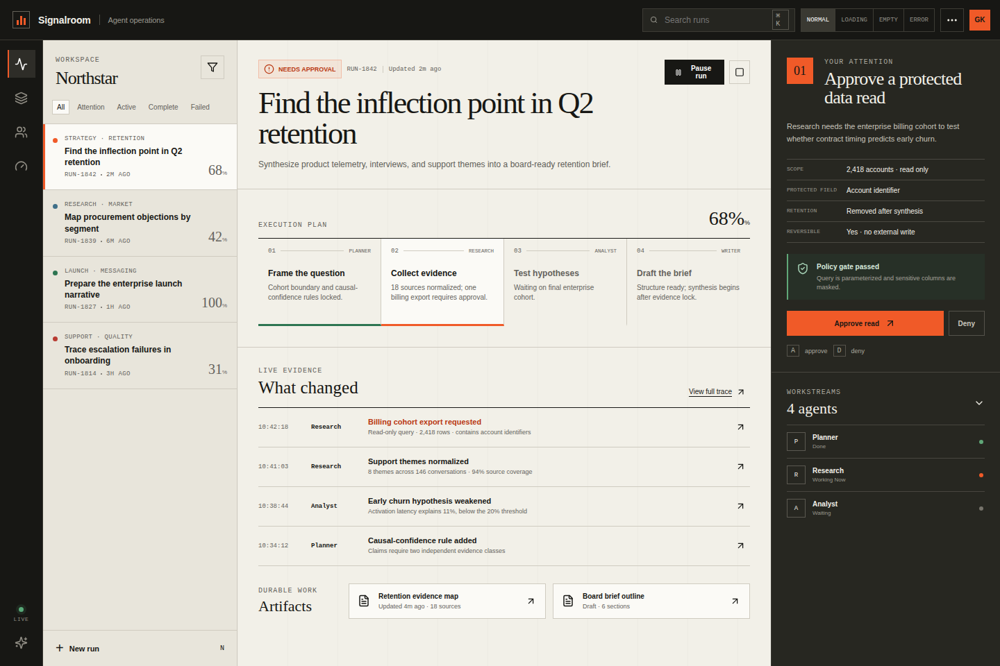
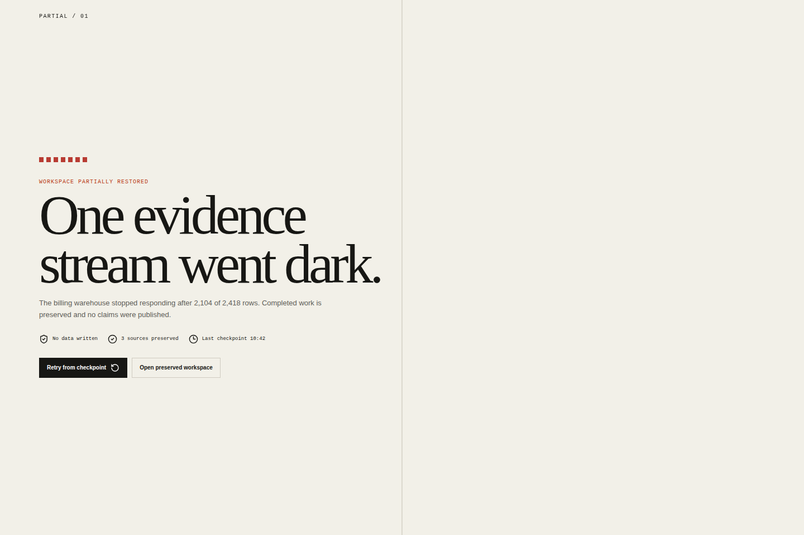

<div align="center">

# Everything Agentic Engineering

## Turn an idea into a distinctive, researched, working product slice—with evidence.

One guided path from product intent to live design, implementation, verification,
and review. Built for Claude Code, Codex, and manual coding workflows.

**Research → Product → Design → Build → Verify → Review**

[Start a project](#run-it) · [See the proof](#see-the-system-working) ·
[Understand the journey](#one-journey-not-a-toolbox) · [Read the docs](#go-deeper-when-you-need-to)

[](https://github.com/Gaurav890/everything-agentic-engineering/stargazers)
[](CONTRIBUTING.md)
[](LICENSE)
[](docs/releases/v0.1.0.md)

</div>

Most starters give you framework choices, a familiar dashboard, and a large
prompt. You still have to discover the product, art-direct the interface, decide
what is real, and reconstruct the reasoning later.

This starter gives you a product-building loop:

- current research when it will change the answer;
- one explicit audience, promise, and useful journey;
- multiple working design directions built from that product—not theme swaps;
- approved design decisions compiled into reusable tokens;
- a bounded vertical slice with tests and running-product evidence;
- separate builder, evaluator, human review, and merge decisions;
- durable context that survives a new session or a different coding client.

## Run it

```bash
git clone https://github.com/Gaurav890/everything-agentic-engineering.git
cd everything-agentic-engineering
./agentic setup create
```

The guide asks what you are building, who it serves, the first useful outcome,
whether **Perplexity-first current research** should shape the first pass, how
design should begin, and where you want to continue. It previews the plan and
asks once before creating a new directory.

When it finishes, copy the one command it prints. Inside the generated project:

```bash
./agentic journey
```

That command shows every stage, its current state, and one exact next action.
Use `./agentic next` later when you want only the next action.

Project creation does not install dependencies or external skills, collect API
keys, start MCP servers, launch a client without confirmation, initialize Git,
deploy, approve design, or merge code.

## See the system working

### One workflow, three reviewed visual systems

These running responsive examples intentionally share one enterprise request
and decision architecture. They demonstrate system-level changes in type,
color, density, geometry, and motion—not the product-specific compositional
divergence required from a fresh custom creative sprint.

<table>
  <tr>
    <td align="center" width="33%">
      <a href="apps/web/tests/visual.spec.ts-snapshots/enterprise-workflow-editorial-signal-desktop-linux.png">
        
      </a>
      <br /><strong>Editorial Signal</strong><br /><sub>Typographic and decisive</sub>
    </td>
    <td align="center" width="33%">
      <a href="apps/web/tests/visual.spec.ts-snapshots/enterprise-workflow-kinetic-index-desktop-linux.png">
        
      </a>
      <br /><strong>Kinetic Index</strong><br /><sub>Energetic and unconventional</sub>
    </td>
    <td align="center" width="33%">
      <a href="apps/web/tests/visual.spec.ts-snapshots/enterprise-workflow-quiet-material-desktop-linux.png">
        
      </a>
      <br /><strong>Quiet Material</strong><br /><sub>Warm and deliberately calm</sub>
    </td>
  </tr>
</table>

Mobile-web evidence:
[Editorial Signal](apps/web/tests/visual.spec.ts-snapshots/enterprise-workflow-editorial-signal-mobile-linux.png) ·
[Kinetic Index](apps/web/tests/visual.spec.ts-snapshots/enterprise-workflow-kinetic-index-mobile-linux.png) ·
[Quiet Material](apps/web/tests/visual.spec.ts-snapshots/enterprise-workflow-quiet-material-mobile-linux.png)

### A real interaction, including failure and recovery

Signalroom is the included operations-console showcase. It demonstrates a
protected decision, interruption, recovery, and durable evidence—not a static
landing-page mockup.

<table>
  <tr>
    <td width="50%">
      <a href="apps/showcase/tests/visual.spec.ts-snapshots/signalroom-normal-desktop-linux.png">
        
      </a>
      <br /><strong>Protected decision flow</strong><br /><sub>Consequences and evidence stay visible before approval.</sub>
    </td>
    <td width="50%">
      <a href="apps/showcase/tests/visual.spec.ts-snapshots/signalroom-error-desktop-linux.png">
        
      </a>
      <br /><strong>Failure and recovery</strong><br /><sub>Error state preserves context and a clear recovery action.</sub>
    </td>
  </tr>
</table>

[Watch the approval, pause, and resume flow](docs/assets/demo/03-signalroom-approval.gif) ·
[Watch normal, loading, empty, and error states](docs/assets/demo/04-running-states.gif)

The animated demonstrations are linked instead of autoplayed so readers can
choose when motion begins. The product itself includes a reduced-motion path.

Run it locally:

```bash
pnpm install --frozen-lockfile
pnpm dev:showcase
```

## One journey, not a toolbox

```text
IDEA
  ↓
RESEARCH     Perplexity for broad current discovery when selected
  ↓          Primary sources/manual research remain a valid fallback
PRODUCT      Audience + promise + one useful journey + recovery
  ↓
DESIGN       Live, product-specific alternatives on different axes
  ↓
SYSTEM       Human-approved direction → tokens + components + motion rules
  ↓
BUILD        One bounded vertical slice
  ↓
VERIFY       Behavior + responsive + accessibility + visual evidence
  ↓
REVIEW       Independent evaluator → human decision → protected merge
```

The headline value is not “many agents, skills, and MCPs.” It is a faster path
to a product people can understand and remember, with enough engineering rigor
for a team to keep building it safely.

### 1. Research enters the product

During creation, choose Perplexity-first research or skip it. If selected, the
generated project activates the existing research profile and creates
`docs/10-product/RESEARCH.md` with a source ledger plus
`.agentic/research.json` as the validated machine state. The active profile is
the routing authority; completion is bound to the source ledger and the
changed/no-change brief decision, and copied text in a research note cannot
advance the flow.

Routing is explicit:

| Need | Route |
|---|---|
| Broad current discovery or multi-source synthesis | Perplexity |
| Authoritative technical/product facts | Official and first-party sources |
| Authorized extraction from a known site | Firecrawl |
| Interactive browser behavior | Playwright |
| External capability unavailable | Primary-source/manual fallback, disclosed |

The starter never asks you to paste a Perplexity key. It leaves MCPs disabled
until you configure them in your own client and keeps credentials in environment
or user scope. A catalog entry never counts as evidence that a tool ran.

[Research policy](docs/60-tooling/RESEARCH_POLICY.md) ·
[MCP routing and setup](docs/60-tooling/MCP_STACK.md) ·
[Compatibility boundaries](docs/60-tooling/MCP_COMPATIBILITY.md)

### 2. Product decisions come before screens

The generated brief captures the audience, promise, first outcome, open
questions, design intent, and selected research path. The assistant confirms one
useful journey—including failure and recovery—before implementation scope is
accepted. Facts, assumptions, and unresolved questions stay distinct.

### 3. Design is a first-class build phase

Custom is the default. A fresh web project starts a creative-direction sprint
that produces working product-specific previews, usually three in the first
round. Each direction must differ in composition or interaction, not merely
palette, and must show realistic states, signature craft, an asset strategy,
purposeful motion, responsive behavior, and reduced-motion behavior.

The project can reject every option, request another, or synthesize a new one.
References are ingredients. Components are structural donors. The project's
approved design system wins. Anthropic frontend-design remains secondary;
Emil Kowalski's reviewed design-engineering suite is the preferred optional
external craft layer when installed.

[Product-design workflow](docs/60-tooling/PROJECT_ONBOARDING.md) ·
[Design resources and exact links](docs/60-tooling/PRODUCT_DESIGN_RESOURCES.md) ·
[Design system](docs/20-design/DESIGN_SYSTEM.md)

### 4. Approval creates a reusable system

An approved direction is compiled into DTCG-compatible primitives, semantics,
component roles, light/dark themes, typography, spacing, radii, border/elevation,
motion, layout, density, and agentic states. Screens consume semantic decisions;
they do not silently invent a new visual language.

### 5. Engineering makes the result credible

Requirements trace to acceptance criteria and bounded tasks. Parallel write
work uses isolated branches/worktrees and explicit file ownership. Verification
distinguishes scaffold checks, running behavior, visual evidence, native gaps,
and production readiness. The builder does not certify its own work.

## Choose only what the product needs

| Starting point | Best for | What remains inactive |
|---|---|---|
| `product` | SaaS and consumer products | Enterprise ceremony, mobile, backend, and research unless selected |
| `agentic-product` | Human-agent planning, progress, approval, and recovery | Hidden or performative agent behavior |
| `enterprise-workflow` | Tenant-aware requests, evidence, decisions, and auditability | Fake production auth, storage, or compliance claims |
| `portfolio` | Authored work and case studies | SaaS dashboard conventions |
| `mobile` | Native planning, guidance, and shared token contracts | Web-only surfaces; runnable native app is not included yet |
| `core` | The workflow without an application shell | Frontend, mobile, backend, and research inventories |

Unselected capabilities stay in the starter catalog but are not copied, routed,
installed, or treated as requirements. Supabase and Convex are mutually
exclusive backend choices.

## The commands most people need

```bash
./agentic setup create     # create a project from a guided brief
./agentic journey          # see the complete path and current state
./agentic next             # get exactly one next action
./agentic design sprint    # build/review product-specific live directions
./agentic tokens build     # compile an approved direction
./agentic verify web       # run web behavior and quality checks
./agentic verify full      # validate the full repository contract
```

Run `./agentic --help` for the complete public command surface. Internal shell
scripts are implementation details; you should not have to discover them.

## Built for serious team workflows

- Durable product, design, architecture, task, decision, and evidence files.
- A protected `main` branch and short-lived task branches.
- Draft pull requests for early visibility.
- Worktrees for parallel features, specifications, research, or reviews.
- One owner per writable file/module and a planned merge order.
- Explicit security, data, auth, migration, rollback, and production boundaries.
- Deterministic checks plus independent product, design, security, QA, and
  integration review where risk requires them.

[Enterprise golden path](docs/60-tooling/ENTERPRISE_GOLDEN_PATH.md) ·
[Parallel terminals](docs/70-collaboration/PARALLEL_TERMINALS.md) ·
[GitHub workflow](docs/70-collaboration/GITHUB_WORKFLOW.md) ·
[Code review](docs/70-collaboration/CODE_REVIEW.md)

## Honest readiness

- Web references and Signalroom run locally.
- The generator creates a personalized workspace and an executable design
  sprint; it does not claim to create a finished product unattended.
- Enterprise identity, persistence, notification, and audit adapters are local
  examples with `production_ready: false`.
- Native mobile is still a planning scaffold, not a runnable Expo application.
- Automated checks cannot prove originality, product-market fit, security, or
  human delight. Those remain evidence and review decisions.
- Five independent newcomer sessions remain the published self-service launch
  gate; synthetic fixtures do not satisfy it.

[Current limitations](docs/60-tooling/COMPATIBILITY.md) ·
[Evaluation rubric](docs/50-evals/RUBRIC.md) ·
[First-project pilot](docs/50-evals/FIRST_PROJECT_PILOT.md)

## Go deeper when you need to

| Need | Read |
|---|---|
| Complete first-project walkthrough | [First project](docs/60-tooling/FIRST_PROJECT.md) |
| Generated-project behavior | [Project generator](docs/60-tooling/PROJECT_GENERATOR.md) |
| Product and design onboarding | [Project onboarding](docs/60-tooling/PROJECT_ONBOARDING.md) |
| Skills and external capabilities | [Skills](docs/60-tooling/SKILLS.md) · [Capabilities](docs/60-tooling/CAPABILITIES.md) |
| Profiles and cleanup | [Profiles](docs/60-tooling/PROFILES.md) |
| Design tokens and visual QA | [Token package](packages/design-tokens/README.md) · [Visual QA](docs/50-evals/VISUAL_QA.md) |
| Security and trust boundaries | [Security model](docs/30-engineering/SECURITY_MODEL.md) |
| Architecture and decisions | [Architecture](docs/30-engineering/ARCHITECTURE.md) · [ADRs](docs/30-engineering/ADR/) |
| Current work and handoff | [Current state](docs/40-execution/CURRENT_STATE.md) · [Handoff](docs/40-execution/HANDOFF.md) |

Open `docs/` as an Obsidian vault if you want a human knowledge cockpit. Git
remains the durable history.

## Help make the proof stronger

Try the public start path without private guidance. If it stalls, report the
exact stage, expected result, actual result, and environment. If it works, share
the product, the direction you rejected, the direction you approved, and the
evidence that changed your decision.

[Open an issue](https://github.com/Gaurav890/everything-agentic-engineering/issues/new/choose) ·
[Contribute](CONTRIBUTING.md) · [Security reporting](SECURITY.md)

---

<div align="center">

**Build the product people remember. Keep the system teams can trust.**

</div>
