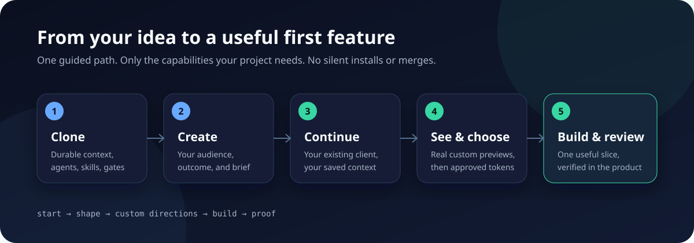
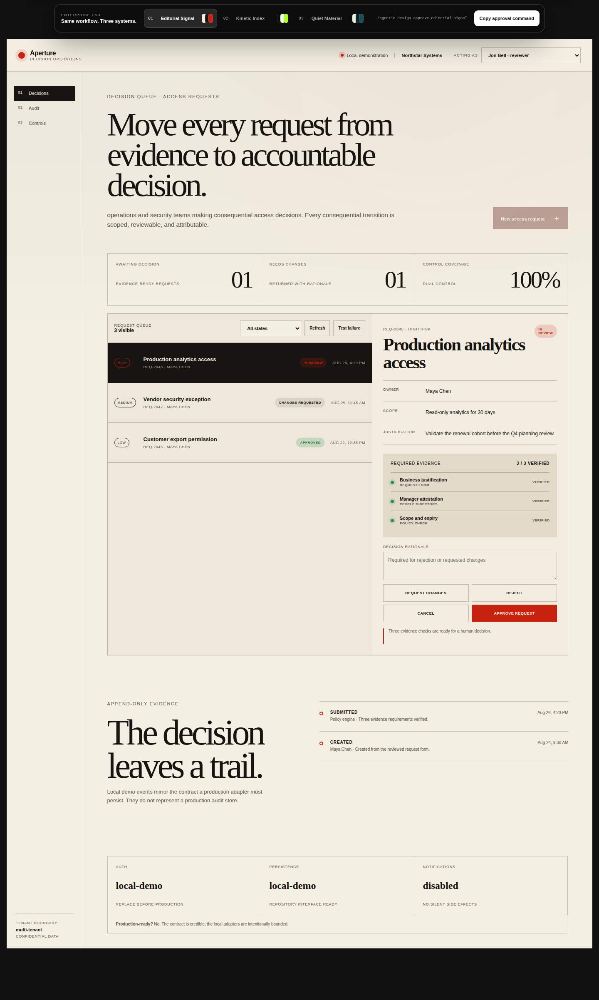
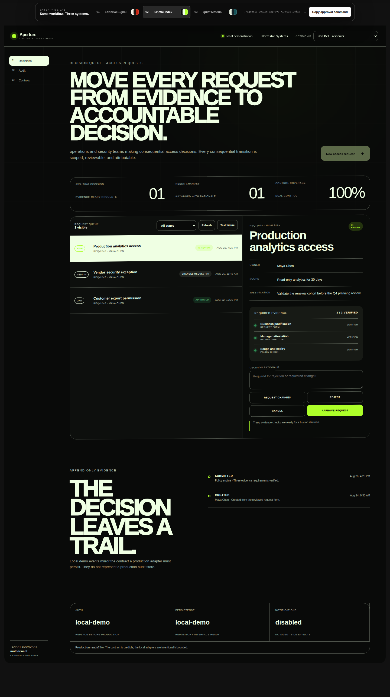
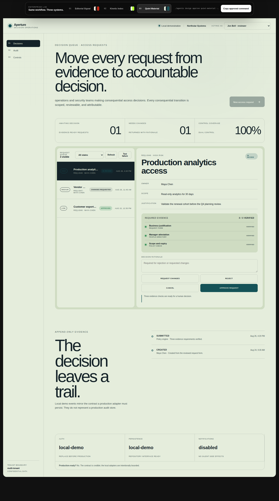
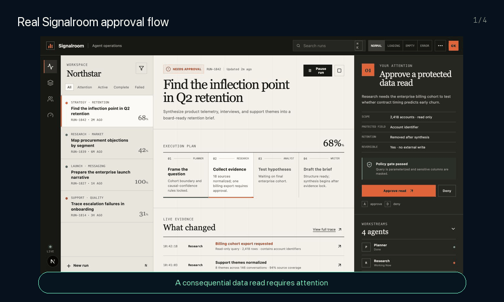
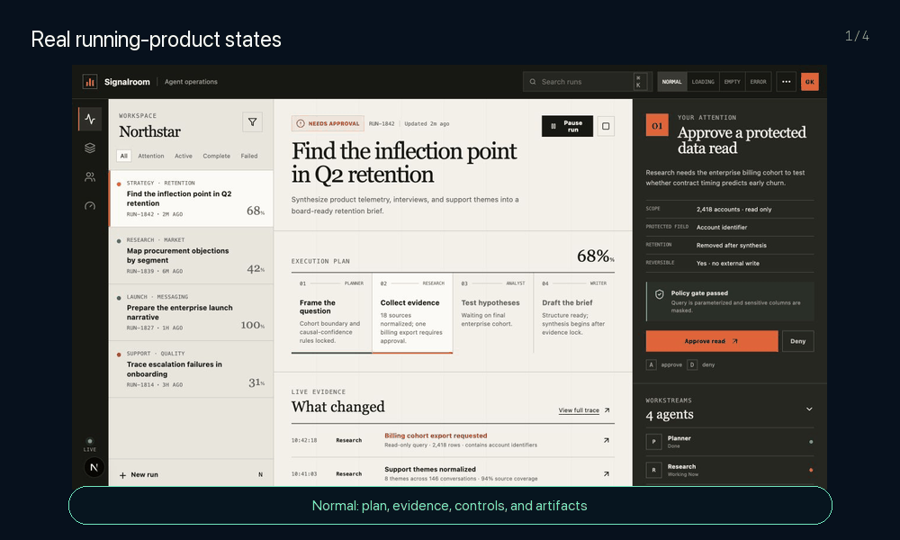
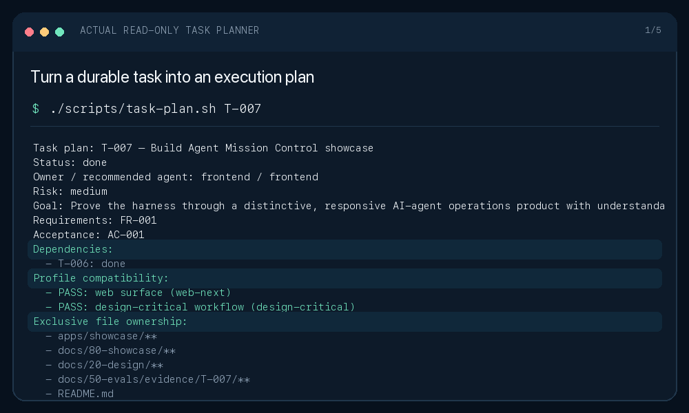
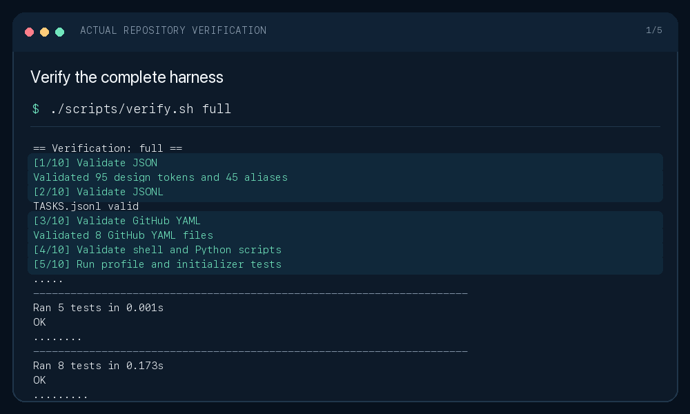

<div align="center">

# Everything Agentic Engineering

### Build software people trust—and interfaces they remember.

**A guided product, design, and engineering system for coding agents.**

Discovery → Product contract → Original design directions → Architecture →
Parallel implementation → Evidence → Pull request → Durable memory

<br />

[](https://github.com/Gaurav890/everything-agentic-engineering/stargazers)
[](CONTRIBUTING.md)
[](LICENSE)
[](docs/releases/v0.1.0.md)

</div>

---

## Start here

```bash
git clone https://github.com/Gaurav890/everything-agentic-engineering.git
cd everything-agentic-engineering
./agentic setup create
```

The guide asks only the decisions that materially change the result, previews
what it will create, and asks once before writing a new project. It installs
nothing, enables no external service, copies no secrets, and does not modify
this starter.

Then enter the generated project and run:

```bash
./agentic next
```

`next` gives you exactly one useful action based on the project’s real state.
Run it again whenever you are unsure what to do.

> **Important:** generate a project from this repository. Do not merely tell a
> coding agent to “use this repo as inspiration.” The generated project is what
> carries the selected profiles, product brief, design contract, verification,
> and safe workflow into the new codebase.



### The first ten minutes

1. Run `./agentic setup create`.
2. Choose what you are building and who it serves.
3. Review the concise creation plan.
4. Enter the generated directory.
5. Run `./agentic next` and follow its single action.
6. Open the live design-direction lab before committing to an aesthetic.
7. Approve or synthesize a direction.
8. Let the repository turn that decision into tokens, tasks, tests, and
   evidence.

No command archaeology. No deleting irrelevant starter folders. No giant prompt
that asks one model to invent the product, design it, build it, and approve
itself.

---

## See what it builds

The same enterprise request-and-decision product is rendered through three
materially different design systems. These are screenshots from the running
reference application on the same Ubuntu environment used by CI—not mockups.

<table>
  <tr>
    <td align="center" width="33%">
      <a href="apps/web/tests/visual.spec.ts-snapshots/enterprise-workflow-editorial-signal-desktop-linux.png">
        
      </a>
      <br /><strong>Editorial Signal</strong><br />Authored, typographic, decisive
    </td>
    <td align="center" width="33%">
      <a href="apps/web/tests/visual.spec.ts-snapshots/enterprise-workflow-kinetic-index-desktop-linux.png">
        
      </a>
      <br /><strong>Kinetic Index</strong><br />High-contrast, energetic, unconventional
    </td>
    <td align="center" width="33%">
      <a href="apps/web/tests/visual.spec.ts-snapshots/enterprise-workflow-quiet-material-desktop-linux.png">
        
      </a>
      <br /><strong>Quiet Material</strong><br />Warm, tactile, deliberately calm
    </td>
  </tr>
</table>

Every direction also has a reviewed mobile composition:
[Editorial Signal](apps/web/tests/visual.spec.ts-snapshots/enterprise-workflow-editorial-signal-mobile-linux.png) ·
[Kinetic Index](apps/web/tests/visual.spec.ts-snapshots/enterprise-workflow-kinetic-index-mobile-linux.png) ·
[Quiet Material](apps/web/tests/visual.spec.ts-snapshots/enterprise-workflow-quiet-material-mobile-linux.png)

The visual language changes. The product contract does not. Each version still
exposes the actor, tenant, request, evidence, rationale, allowed decisions,
consequences, audit trail, recovery behavior, and production boundary.

### A real interactive showcase

`apps/showcase` contains **Signalroom**, an agent-operations console built
through the same product-design and evidence workflow.



Normal, loading, empty, and error are implemented states—not decorative
screenshots:



Run it locally:

```bash
pnpm install
pnpm dev:showcase
```

---

## Choose the product you are actually building

| Starting point | Use it for | What stays out |
|---|---|---|
| `product` | SaaS, consumer products, high-end product narratives | Enterprise workflow ceremony unless needed |
| `agentic-product` | Human-agent interfaces with plans, progress, tools, approvals, and recovery | Hidden or performative “agent” behavior |
| `enterprise-workflow` | Multi-tenant operations, requests, evidence, decisions, and auditability | Fake production auth, storage, or compliance claims |
| `portfolio` | Authored work, case studies, and personal positioning | SaaS dashboard conventions |
| `mobile` | Expo and React Native products | Web-only agents and surfaces |
| `core` | The engineering harness without an application shell | Frontend and mobile inventory |

Web projects inherit the design-critical profile automatically. Mobile, backend,
research, and optional external capabilities activate only when the selected
project needs them.

```bash
./agentic profile resolve
./agentic profile doctor
./agentic capabilities plan
```

If you are not building a mobile application, mobile guidance remains inactive.
If you do not need crawling, research MCPs remain inactive. Supabase and Convex
are mutually exclusive backend choices by design.

---

## Why the frontend does not start as generic generated UI

The design engine runs product thinking before visual production:

```text
DISCOVERY
→ USER NEEDS
→ BENCHMARK
→ UX STRATEGY
→ INTERACTION MODEL
→ ADAPTIVE DESIGN INTAKE
→ REALISTIC DESIGN DIRECTIONS
→ HUMAN SELECTION OR SYNTHESIS
→ DESIGN SYSTEM
→ DTCG-COMPATIBLE TOKENS
→ IMPLEMENTATION
→ RUNNING-PRODUCT AUDITS
→ INDEPENDENT CRITIQUE
→ POLISH
```

The router runs only missing or stale phases. A small settings fix does not
repeat discovery. A new product does not skip it.

The non-negotiable rules are:

- References are ingredients, not templates.
- Components are structural donors, not product identity.
- Tokens encode approved decisions; they do not invent the direction.
- The project design system wins every conflict.
- Motion must communicate causality, continuity, hierarchy, feedback, or state.
- Responsive, accessibility, token, system, and performance audits remain
  separate gates.
- The builder does not certify its own work.

The design-direction lab makes aesthetic choices visible before implementation
locks them in. Approve one direction—or request a synthesis—then build tokens:

```bash
./agentic design approve editorial-signal --yes
./agentic tokens build
```

The token system covers color, typography, spacing, radii, borders, elevation,
motion, layout, density, themes, components, and agent states. Redesigns change
approved semantic decisions instead of repainting every screen.

Optional design skills remain precisely routed. The reviewed Emil Kowalski
design-engineering suite is the preferred external craft pass for substantial
web UI; other design skills and component libraries are used only for their
appropriate phase. None becomes the product’s art director.

```bash
./agentic setup skills
```

Skill installation is explicit and profile-aware. The command never runs as a
side effect of project creation.

---

## The enterprise golden path

Selecting `enterprise-workflow` adds four questions:

1. What business object moves through the workflow?
2. What is the tenant model?
3. What approval model governs consequential transitions?
4. What is the data sensitivity?

The generated project then includes:

- product requirements and stable acceptance IDs;
- user journeys, alternative paths, failures, and recovery;
- role and permission matrix;
- tenant and authorization boundaries;
- data model and API contract;
- security model and audit-event vocabulary;
- a runnable request → evidence → review → decision → audit slice;
- loading, empty, invalid, partial, failure, recovery, disabled, and terminal
  states;
- domain, repository, API, browser, accessibility, and visual tests;
- explicit `local-demo` adapters and `production_ready: false` disclosure.

This is a credible vertical slice, not a fake enterprise claim. Production
identity, persistence, notifications, compliance evidence, and deployment must
still be connected and reviewed for the real organization.

Read the [enterprise golden-path guide](docs/60-tooling/ENTERPRISE_GOLDEN_PATH.md).

---

## From idea to reviewed change

```text
IDEA
  ↓
PRODUCT BRIEF + PRD
  ↓
REQUIREMENT IDs + ACCEPTANCE CRITERIA
  ↓
ARCHITECTURE + TASK GRAPH
  ↓
SHORT-LIVED BRANCH OR ISOLATED WORKTREE
  ↓
IMPLEMENTATION
  ↓
TESTS + RUNNING-PRODUCT EVIDENCE
  ↓
INDEPENDENT PRODUCT / SECURITY REVIEW
  ↓
PULL REQUEST
  ↓
HUMAN APPROVAL + PROTECTED MERGE
  ↓
DURABLE STATE
```

The repository—not chat history—owns the truth:

| Artifact | Owns |
|---|---|
| `CLAUDE.md` / `AGENTS.md` | Universal project operating contract |
| `docs/10-product/` | Product requirements and acceptance |
| `docs/20-design/` | Interaction, direction, system, and design decisions |
| `docs/30-engineering/` | Architecture, data, API, and security boundaries |
| `docs/40-execution/TASKS.jsonl` | Atomic work, dependencies, owners, and status |
| `CURRENT_STATE.md`, `PROGRESS.md`, `HANDOFF.md` | Durable continuity between sessions |
| `docs/50-evals/` | Rubrics, test matrices, and evidence |
| Git and GitHub | Checkpoints, collaboration, review, and merge history |

Traceability remains explicit:

```text
Idea → Requirement → Acceptance criterion → Task → Code → Test → Evidence
```

---

## Parallel work without merge chaos

Use one accountable owner and parallelize independent outputs—not shared state.

```bash
./agentic task plan T-101
./agentic task start T-101 --yes
./agentic workspace worktree T-102 frontend main
./agentic workspace worktree T-103 backend main
```

Before parallel writers begin, the task plan establishes dependencies, file
ownership, integration contracts, verification gates, and merge order. Each
writer receives an isolated branch/worktree. Researchers, architects, and
critics may work in parallel without mutating shared implementation files.



Read the [parallel work guide](docs/70-collaboration/PARALLEL_TERMINALS.md).

---

## The commands most people need

| Goal | Command |
|---|---|
| Create a clean project | `./agentic setup create` |
| Get one next action | `./agentic next` |
| See active profiles | `./agentic profile resolve` |
| Diagnose project setup | `./agentic profile doctor` |
| Compare design directions | `./agentic design preview` |
| Approve a direction | `./agentic design approve <direction> --yes` |
| Build design tokens | `./agentic tokens build` |
| Plan a task safely | `./agentic task plan T-101` |
| Start isolated work | `./agentic task start T-101 --yes` |
| Check optional capabilities | `./agentic capabilities plan --task T-101` |
| Verify everything | `./agentic verify full` |
| Discover every command | `./agentic commands` |

The command interface is intentionally small. Internal scripts remain available
for compatibility and CI, but users should begin with `./agentic`.

---

## Verification is evidence, not confidence

The full gate validates:

- JSON, task ledgers, profiles, and generated-project contracts;
- design tokens, themes, aliases, and contrast requirements;
- shell/Python syntax and deterministic security hooks;
- domain, API, application, and adapter tests;
- lint, types, production builds, and local documentation links;
- browser interaction, keyboard behavior, accessibility, mobile overflow, and
  reduced motion;
- reviewed Linux visual baselines for every shipped direction and viewport;
- GitHub issue, task, branch, pull-request, and review policy.

```bash
./agentic verify full
```



Visual redesigns generate candidates. CI never silently turns new screenshots
into approved truth; a human reviews them before they become baselines.

---

## Safe by default

Project creation and profile selection do **not**:

- install dependencies, plugins, skills, or external agents;
- enable MCP servers or network access;
- copy secrets, `.env`, Git history, or starter execution history;
- create production infrastructure or deploy anything;
- grant approval, credential, sandbox, or merge authority;
- remove unrelated files from an existing project.

Deterministic hooks block obvious destructive commands and scan edits for likely
secrets. External pages, issues, MCP results, and crawled content are treated as
untrusted input.

Optional MCP capabilities are documented and client-specific:

- **Perplexity** for broad current research;
- **Firecrawl** for authorized scrape/map/crawl/extract work;
- **Playwright** for real browser interaction and inspection.

```bash
./agentic doctor mcp
./agentic doctor plugin
./agentic doctor codex
```

Doctors report drift. They do not install, upgrade, authenticate, or enable the
capability they inspect.

Read the [security model](docs/30-engineering/SECURITY_MODEL.md) and
[compatibility boundaries](docs/60-tooling/COMPATIBILITY.md).

---

## Repository map

```text
agentic                 One public command interface
.agentic/               Profiles, resources, runtime policy, project contracts
.claude/                Shared rules, skills, agents, and hooks
.agents/skills          Shared skill discovery
.codex/                 Codex project adapter and hooks
apps/web/               Multi-archetype product/design reference lab
apps/showcase/          Signalroom interactive engineering showcase
apps/mobile/            Mobile surface when its profile is active
packages/               Types, domain, API, data, UI, config, design tokens
docs/                   Product, design, engineering, execution, evals, tooling
scripts/                Implementations and compatibility adapters
```

Open `docs/` directly as an Obsidian vault if you want a human knowledge
cockpit. Markdown and Git remain the durable source of truth.

---

## Go deeper only when you need to

| Need | Read |
|---|---|
| First-run and generated projects | [Project generator](docs/60-tooling/PROJECT_GENERATOR.md) |
| Enterprise workflow products | [Enterprise golden path](docs/60-tooling/ENTERPRISE_GOLDEN_PATH.md) |
| Portfolio products | [Portfolio golden path](docs/60-tooling/PORTFOLIO_GOLDEN_PATH.md) |
| Profiles and cleanup | [Profiles](docs/60-tooling/PROFILES.md) |
| Product-design sources and routing | [Design resource catalog](docs/60-tooling/PRODUCT_DESIGN_RESOURCES.md) |
| Skills and capability decisions | [Skills](docs/60-tooling/SKILLS.md) · [Capabilities](docs/60-tooling/CAPABILITIES.md) |
| Collaboration and pull requests | [GitHub workflow](docs/70-collaboration/GITHUB_WORKFLOW.md) |
| Parallel terminals/worktrees | [Parallel work](docs/70-collaboration/PARALLEL_TERMINALS.md) |
| Review and task finalization | [PR finalization](docs/70-collaboration/PR_FINALIZATION.md) |
| Security and trust boundaries | [Security model](docs/30-engineering/SECURITY_MODEL.md) |
| Evaluation and visual QA | [Rubric](docs/50-evals/RUBRIC.md) · [Visual QA](docs/50-evals/VISUAL_QA.md) |
| Current limitations | [Compatibility](docs/60-tooling/COMPATIBILITY.md) |
| Contributing | [Contributing guide](CONTRIBUTING.md) |

---

## What this is—and is not

This is an opinionated system for making software development with coding
agents more original, durable, collaborative, testable, and accountable.

It is not a collection of hundreds of agents, a prompt dump, a replacement for
engineering judgment, a guarantee of autonomous correctness, or permission to
give a model production credentials.

The core principles are simple:

> **The conversation is disposable. The repository is durable memory.**

> **Parallelize independent outputs, not shared state.**

> **One agent builds. Another evaluates.**

> **References are ingredients. The project design system wins.**

> **Evidence beats confidence.**

> **A task is not done until reality agrees.**

---

## Contributing

Contributions are welcome: real-world examples, profiles, accessibility and
security improvements, evaluation patterns, focused skills, and documentation
clarity are especially valuable.

Please keep each pull request coherent and evidence-backed. Read
[CONTRIBUTING.md](CONTRIBUTING.md) before starting.

For maintainers, see the [release runbook](docs/70-collaboration/RELEASING.md).

<div align="center">

### Stop giving coding agents prompts. Give them an engineering system.

[⭐ Star](https://github.com/Gaurav890/everything-agentic-engineering) ·
[🐛 Issues](https://github.com/Gaurav890/everything-agentic-engineering/issues) ·
[🔀 Contribute](CONTRIBUTING.md)

</div>
